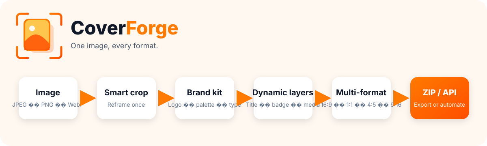

<p align="center">
  
</p>

# CoverForge — guide français

**Une image, tous les formats. Branding automatisé, self-hosted et pilotable par API.**

CoverForge transforme une image source et une identité de marque en plusieurs visuels cohérents : YouTube, carré, feed 4:5, vertical 9:16, paysage social, ou n’importe quel format défini dans un modèle JSON.



```text
Image → Smart Reframe → Brand Kit → Calques dynamiques → Multi-format → ZIP / API
```

## Proposition produit

CoverForge est un studio de **branding automation**. Il s’adresse aux créateurs, marques, agences, équipes social media, e-commerce et pipelines automatisés.

Le produit sépare volontairement :

1. l’image source ;
2. l’identité visuelle ;
3. les mises en page par format ;
4. le rendu final.

L’éditeur navigateur repose sur Svelte 5 + Fabric.js. Le rendu de production est réalisé par Rust + resvg/tiny-skia pour rester déterministe.

## Importer une image

Depuis **Projet / 项目**, glisse une image ou utilise le sélecteur de fichier.

Formats raster acceptés :

- JPEG ;
- PNG ;
- WebP.

Les logos SVG sont acceptés après validation de sécurité.

Une image importée peut être remplacée sans détruire :

- le titre ;
- le sous-titre ;
- les logos ;
- les positions ;
- les réglages du Brand Kit.

Les assets importés restent réutilisables dans la **Bibliothèque / 素材库** pendant la session.

## Smart Reframe

**Smart Reframe / 智能裁切** calcule localement un point focal et un crop adapté à chaque ratio.

Le moteur :

- analyse une version réduite de l’image ;
- favorise les zones détaillées et contrastées ;
- prend en compte la saturation ;
- applique une légère préférence compositionnelle type règle des tiers ;
- reste déterministe ;
- ne dépend d’aucune API externe.

Tu peux :

- utiliser le point focal automatique ;
- déplacer le point focal global ;
- conserver un réglage manuel sur un format donné ;
- réinitialiser un format en mode automatique.

## Brand Kit

Le **Kit de marque / 品牌工具包** stocke dans le modèle :

- nom de marque ;
- résumé visuel ;
- logo principal ;
- logo secondaire ;
- palette ;
- rôles typographiques ;
- notes.

Les fichiers de police propriétaires ne sont pas inclus dans le dépôt public. CoverForge sait utiliser les polices système, les familles libres de l’image Docker et les polices personnalisées ajoutées sur ton instance.

## Calques dynamiques

Types de calques :

- image ;
- texte ;
- rectangle.

Chaque calque possède un identifiant stable pour l’API.

Les textes peuvent utiliser des variables :

```text
{{title}}
{{subtitle}}
{{badge}}
{{episode}}
```

L’éditeur propose notamment :

- X / Y / largeur / hauteur avec réglette et valeur numérique ;
- opacité ;
- rotation ;
- alignement ;
- couleur et contour ;
- famille de police ;
- variante réelle de police ;
- auto-fit ;
- taille minimale ;
- nombre de lignes maximal ;
- focal X/Y pour les images ;
- ordre, visibilité, verrouillage, duplication et suppression.

## Multi-format

Le modèle générique `starter-brand` fournit :

| Format | Taille |
| --- | ---: |
| YouTube 16:9 | 1920×1080 |
| Carré 1:1 | 1080×1080 |
| Feed 4:5 | 1080×1350 |
| Vertical 9:16 | 1080×1920 |
| Paysage 1.91:1 | 1200×628 |

Chaque format possède ses propres calques. Modifier le placement d’un titre sur un vertical n’oblige pas à modifier le carré.

## Export ZIP

Dans **Exports / 导出**, tu peux :

- rendre uniquement les formats sélectionnés ;
- rendre tous les formats ;
- télécharger chaque image séparément ;
- télécharger un ZIP.

Le ZIP contient :

- les images rendues ;
- un `manifest.json`.

Le manifest décrit notamment :

- version CoverForge ;
- date de génération ;
- modèle ;
- image source ;
- variables ;
- formats ;
- dimensions ;
- noms de fichiers.

## API et OpenAPI

Documentation dynamique :

```text
GET /openapi.json
```

Routes principales :

```text
POST /v1/assets
POST /v1/reframe
POST /v1/render
POST /v1/render/preview
POST /v1/render/batch
POST /v1/render/package
```

Découverte des variables d’un modèle :

```text
GET /v1/templates/{id}/dataset
```

Exemples complets : [docs/API.md](docs/API.md).

## Démarrage Docker

```bash
docker build -t coverforge .
docker run --rm -p 3099:3099 \
  -e COVERFORGE_BIND=0.0.0.0:3099 \
  -e COVERFORGE_DEFAULT_TEMPLATE_DIR=/app/default-templates \
  coverforge
```

Puis ouvre :

```text
http://localhost:3099
```

Le `compose.yaml` du dépôt correspond volontairement au déploiement Cloud9 existant. Pour une autre machine, adapte les bind mounts.

## Sécurité

CoverForge protège notamment :

- taille maximale des uploads ;
- limite de pixels décodés ;
- détection réelle du format image ;
- normalisation EXIF des JPEG ;
- rejet des SVG actifs ou faisant référence à des ressources externes ;
- accès fichiers limité aux racines autorisées ;
- ZIP sans traversée de chemin ;
- rendu et Smart Reframe locaux.

L’instance n’ajoute pas d’authentification applicative en v0.6. Si tu l’exposes publiquement, protège-la via ton reverse proxy ou ton système d’accès.

## Compatibilité AutoPublisher

L’ancien endpoint reste disponible :

```text
POST /api/generate
```

Les anciens noms comme `DPAFM - YT` continuent d’être résolus vers leur modèle et leur format.

Les modèles historiques `cf`, `cp`, `dpafm`, `lcfp`, etc. restent valides. Ils sont désormais simplement des cas spécialisés du moteur générique de branding.

## Modèles JSON

Le JSON reste la source de vérité.

Voir : [docs/SHOW_STYLES.md](docs/SHOW_STYLES.md).

Le modèle intégré `starter-brand` est fourni depuis le répertoire de modèles par défaut de l’image Docker. Un modèle utilisateur portant le même id prend la priorité.

## Contribution

Avant un commit :

```bash
cargo fmt --check
cargo test --locked
cargo clippy --locked --all-targets -- -D warnings

cd web
npm ci
npm run check
npm test
npm run build
```

Les assets privés, polices commerciales et secrets ne doivent pas être commités.

## Licence

MIT
